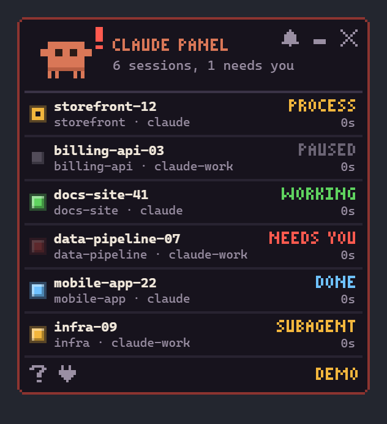

# Claude Panel

A small always-on-top desktop widget for Windows that shows the live state of every
open Claude Code session: one traffic light per session, native notifications, a mini
mode, and a pixel-art mascot that brings the panel in when the first session opens
and carries it away when the last one closes.



> **Unofficial community project.** Claude Panel is not affiliated with, endorsed by,
> or sponsored by Anthropic. "Claude" and "Claude Code" are trademarks of Anthropic,
> PBC. The mascot is original pixel art drawn for this project.

## Download and install

Releases are published on the [Releases page](../../releases). Two files are offered
for Windows 10/11 (x64):

| File | Use |
| --- | --- |
| `claude-panel-<version>-windows-x64-setup.exe` | Installer. Per user, no administrator rights. |
| `claude-panel-<version>-windows-x64-portable.zip` | Portable. Extract anywhere and run `claude-panel.exe`. |

The WebView2 runtime is required; it is part of Windows 11 and of current Windows 10.

### SmartScreen warning

The executables are not code-signed, so Windows SmartScreen may show "Windows
protected your PC". Verify the download first, then choose **More info** and
**Run anyway**.

### Verify the download

Each release includes a `SHA256SUMS` file. In PowerShell:

```powershell
Get-FileHash .\claude-panel-0.1.0-windows-x64-setup.exe -Algorithm SHA256
```

The hash must match the line for that file in `SHA256SUMS`.

## Using the panel

- **It only appears when there is something to show.** With no Claude Code session
  open the panel is fully hidden and only the tray icon remains. When the first
  session opens, the mascot arrives and pulls the panel out; a few seconds after the
  last session closes, it packs the panel and leaves.
- Drag the panel anywhere. Position, mode and settings are remembered.
- Double-click the panel, press the `_` button, or use the tray menu to switch between
  the full panel and the mini pill (one light per session).
- The bell mutes notifications. The `x` button hides the panel until the tray icon is
  clicked or the next first session opens.
- `?` shows the legend. The plug button manages hooks.
- Tray menu: Show / Hide, Toggle mini mode, Mute notifications, Launch at sign-in, Quit.

### States

| State | Light | Meaning |
| --- | --- | --- |
| Working | green, pulsing | The model is generating or running tools. |
| Needs you | red, blinking; red frame | A permission prompt, question or elicitation is pending. |
| Done | blue, steady | The turn finished; the session awaits the next prompt. |
| Waiting for subagent | amber, solid | The main agent is idle while subagents are still running. |
| Waiting for process | amber, hollow | The main agent is idle while a background shell is still running. |
| Paused | dim grey | Idle for more than ten minutes. |

Notifications are shown when a session enters **Needs you** or **Done**, debounced so
that a turn which continues immediately stays silent.

### Launch at sign-in

The installed application starts with Windows by default and waits in the tray. The
entry is a per-user registry value (no administrator rights, no service, no scheduled
task):

```
HKEY_CURRENT_USER\Software\Microsoft\Windows\CurrentVersion\Run
  Claude Panel = "<install folder>\claude-panel.exe" --autostart
```

Clear **Launch at sign-in** in the tray menu to remove it; the choice is remembered
and an upgrade does not turn it back on. The portable build and builds run from
source do not register themselves unless the tray option is ticked. If the
installation moves, the entry is corrected on the next start. The uninstaller removes it.

## Hooks (optional)

Without hooks the panel reads Claude Code's local session registry, which is enough
for working, done, needs-you and background-process states. Installing hooks adds
precision: subagents, the exact end of a turn, and the kind of prompt that is pending.

Hooks are entries in each profile's `settings.json` that make Claude Code run
`cpanel-hook.exe` on session events. Nothing is installed automatically. Use the plug
button (two presses: the second confirms) or the command line:

```
claude-panel.exe --install-hooks --dry-run    # show the lines that would be added
claude-panel.exe --install-hooks
claude-panel.exe --hooks-status
claude-panel.exe --remove-hooks
```

Installing is safe to undo:

- A backup `settings.json.cpanel-backup-YYYYMMDD-HHMMSS` is written next to the file
  first, and the file is replaced atomically.
- Existing entries, unknown keys and the key order are left untouched; one entry per
  event is appended. Running the action again changes nothing.
- **Remove hooks** deletes exactly the entries that were added and nothing else.
- A file that is not plain JSON, a hard-linked file, or a file that another program
  changed during the operation is left alone and reported. Symbolic links are followed.
  Profiles sharing one settings file are handled once.

Open sessions pick up hook changes after they are restarted.

The application remembers which settings files hooks were installed into
(`%APPDATA%\io.github.dioneldaf.claude-panel\hooks-state.json`). If those entries
disappear without the user asking for it (an upgrade that runs the previous
uninstaller, a cancelled uninstall) or end up pointing at a folder that no longer
exists (the installation moved), they are restored the next time the application
starts, with the usual backup. Entries removed with **Remove hooks**, or deleted by
hand from `settings.json`, are not restored.

The entry added for each event looks like this:

```json
{
  "hooks": [
    {
      "type": "command",
      "command": "C:/Users/example/AppData/Local/Claude Panel/cpanel-hook.exe",
      "args": ["--profile", "claude"],
      "async": true,
      "timeout": 5
    }
  ]
}
```

## Privacy

- Everything stays on the computer. The application makes no network requests and
  contains no telemetry, analytics or update checks.
- The hook forwarder sends one small datagram per event to the loopback address
  `127.0.0.1:47615` (UDP), and only the panel listens there. The datagram carries the
  event name, session id, working directory, tool name and key names; never prompts,
  tool inputs or tool outputs.
- The session registry folder also contains `.key` files. They are never opened: only
  files named `<number>.json` are read.
- A debugging log of received hook summaries is kept at
  `%LOCALAPPDATA%\io.github.dioneldaf.claude-panel\logs\hook-events.jsonl`
  (1 MB, one previous generation).

## Uninstall

Use **Settings > Apps > Installed apps**, or the uninstaller in the installation
folder. Before deleting any file the uninstaller removes the hook entries of this
installation from every profile and from every other settings file hooks were
installed into, and deletes the launch-at-sign-in entry, so no hook is left pointing
at a missing executable. Entries that belong to another copy of the application (a
portable folder, for example) are left alone.

If a settings file cannot be cleaned (it is not plain JSON, is hard-linked, or keeps
changing), the uninstaller names it in a message; a silent uninstall writes the same
to `%LOCALAPPDATA%\io.github.dioneldaf.claude-panel\logs\uninstall-cleanup.log`.
Clean those files as described below.

Upgrading by running a newer installer keeps the hooks: if the previous version is
uninstalled first, the new version restores them on its first start.

**Portable build:** remove the hooks (plug button or `claude-panel.exe --remove-hooks`)
and clear **Launch at sign-in** before deleting the folder.

**If hooks were left behind** (for example the folder was deleted first), Claude Code
reports a hook error on every event. Either start any copy of Claude Panel, which
shows the entries as *broken* and can remove or repair them, or delete the entries
whose `command` ends in `cpanel-hook.exe` from each `settings.json` under
`%USERPROFILE%\.claude*`, or restore a `settings.json.cpanel-backup-*` file.

## Known limitations

- Windows only. The session registry is not a documented interface and may change
  with a Claude Code update; the panel then shows fewer details rather than failing.
- Without hooks, subagents are not visible.
- No hook fires when a permission is granted. The panel leaves **Needs you** when the
  registry status changes; if that happens within the one-second polling interval the
  row stays on **Needs you** until the tool finishes.
- No hook is known to fire when a background shell ends; the registry status is used.
  The tool name `Monitor` is treated as a background task on an assumption.
- Subagent counters are ignored after thirty minutes without any event from a session.
- Notifications from a build that is not installed appear under the PowerShell identity.
- A second running copy cannot bind the UDP port and works from the registry alone.
- Any local process can send datagrams to the UDP port. They are validated and capped,
  and can only affect what the panel displays for sessions that really exist.
- The settings file is re-read immediately before it is replaced, which narrows but
  does not eliminate the window for a concurrent edit; the file is not locked.
- Not handled: permission bits of the rewritten settings file on non-Windows systems;
  numbers beyond 64-bit precision in `settings.json` would be reformatted; old
  backups are never pruned.
- If the launch-at-sign-in value is deleted outside the application (for example with
  the registry editor) while the tray option is on, the installed application writes
  it again on its next start. Use the tray option to turn it off.
- After an upgrade that uninstalls the previous version first, the hooks are missing
  until the new version has been started once. Each such upgrade leaves two extra
  backups per settings file.
- Running `uninstall.exe` by hand with the `_?=` argument looks like an upgrade to the
  uninstaller: the hooks are removed, but `hooks-state.json` is kept and would restore
  them if the application were installed again.
- The installer, the uninstaller's clean-up and the upgrade path have not yet been
  exercised on a clean machine for this first release.

## Build from source

Requirements: Rust (stable), Node 22.2 or newer, pnpm, and the WebView2 runtime.

```
pnpm install
pnpm app:dev        # development: Vite dev server and debug build
pnpm test:all       # cargo test --workspace and vitest
pnpm app:exe        # release executables only (target/release)
pnpm app:build      # installer, portable zip and SHA256SUMS in release/
```

Useful options of `claude-panel.exe`:

| Option | Effect |
| --- | --- |
| `--demo` (or `CPANEL_DEMO=1`) | Fake sessions cycling through every state. |
| `--demo-cycle` | As `--demo`, and all sessions close every 26 seconds to show the exit and entrance. |
| `--config-dir <dir>` | Limit hook actions to one configuration directory (repeatable). |
| `--dry-run` | With `--install-hooks` or `--remove-hooks`: print the changes only. |
| `--uninstall-cleanup` | Used by the uninstaller: remove this installation's hook entries everywhere. |

The release build is a GUI application, so command-line output is visible only when it
is piped or redirected (for example `claude-panel.exe --hooks-status | more`).
`CPANEL_PORT` changes the UDP port for both executables.

### Layout

```
crates/cpanel-core   pure logic: state reducer, notifier, visibility state machine,
                     registry adapter, hook wire format, settings merge, autostart policy
crates/cpanel-hook   the hook forwarder
src-tauri            window, tray, polling and listener threads, drag loop, CLI, installer config
src                  frontend: rendering, mascot, entrance and exit choreography, drag physics
scripts              icon generator, release packaging, version check
```

### How the state is derived

The registry gives discovery and a coarse status (`busy`, `idle`, `shell`, `waiting`);
hooks give fine-grained events. Whichever source reported a change most recently
decides between working and idle. A registry status change newer than the last hook
event wins (an interrupt fires no hook), while a registry rewrite with an unchanged
status cannot hide a pending prompt.

| Registry `status` | Shown as |
| --- | --- |
| `busy` | Working |
| `idle` | Done, then Paused after ten minutes |
| `shell` | Waiting for process |
| `waiting` | Needs you |
| anything else | Done (the raw value is shown in the row tooltip) |

### Renaming

The product name is defined in `src/branding.ts`, `crates/cpanel-core/src/lib.rs`
(`PRODUCT_NAME`) and `src-tauri/tauri.conf.json` (`productName`, window `title`); a
test fails if they differ. The mascot name is `MASCOT_NAME` in `src/branding.ts` and
its artwork is `src/mascot.ts`.

### Releasing

Set the same version in `package.json`, `Cargo.toml` (`[workspace.package]`) and
`src-tauri/tauri.conf.json`, update `CHANGELOG.md`, and push a tag `v<version>`. The
release workflow checks that the tag matches, runs the tests, builds the installer and
the portable archive, and creates a draft release with `SHA256SUMS`.

## License

MIT. See [LICENSE](LICENSE).
